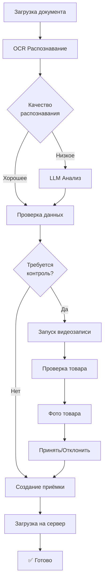

# TMC Warehouse - Система приёмки ТМЦ


Клиент-серверное приложение для автоматизированной приёмки товарно-материальных ценностей с использованием OCR, LLM-анализа и входного контроля с видеофиксацией.

## 🌟 Основные возможностии

### 📄 Умное распознавание документов
- **Tesseract OCR** - распознавание ТТН из PDF и изображений
- **LLM-анализ** - дополнительный парсинг через GPT-4o-mini для сложных случаев
- **Цветовая индикация** - автоматическое выделение подозрительных полей


### 🎥 Видеофиксация входного контроля  
- Запись процесса приёмки товаров
- Синхронизация видео с данными проверки
- Автоматическое сохранение на сервер


### 📸 Фотофиксация товаров
- Создание фото каждого товара
- Привязка фотографий к позициям
- Скачивание всех фото в ZIP архиве


### ✅ Гибкий входной контроль
- Различные типы проверок (вес, размеры, визуальный осмотр, количество)
- Пошаговые инструкции для оператора
- Принятие/отказ с комментариями


### 📋 История и отчётность
- Полная история всех приёмок
- Детальный просмотр с фото и видео
- Скачивание документов и медиафайлов


### 🗄️ Справочник товаров
- База данных товаров с параметрами контроля
- Быстрый поиск по артикулу или названию
- Настройка требований к проверкам


---

## 🎬 Визуальный процесс работы

````carousel
### Шаг 1: Главное окно


Запустите клиент и нажмите **"Принять ТМЦ на склад"**
<!-- slide -->
### Шаг 2: Загрузка документа


Выберите PDF или изображение ТТН для загрузки
<!-- slide -->
### Шаг 3: Запуск OCR


Нажмите "Распознать" для автоматического извлечения данных
<!-- slide -->
### Шаг 4: Результаты распознавания


Проверьте данные. Цветовая индикация показывает уверенность:
- 🟢 Зелёный - данные достоверны
- 🟡 Жёлтый - низкая уверенность, проверьте
- 🔴 Красный - требуется исправление
<!-- slide -->
### Шаг 5: Входной контроль


Для товаров с контролем: запустите видеозапись и следуйте инструкциям
<!-- slide -->
### Шаг 6: Принятие решения


Примите или отклоните товар, добавьте комментарий при необходимости
<!-- slide -->
### Шаг 7: Статусы проверки


Все товары отмечены статусами: ✅ Принято, ❌ Отклонено, ⏳ Ожидает
<!-- slide -->
### Шаг 8: Просмотр истории


Откройте детали любой приёмки для просмотра результатов
````

---

## 🚀 Быстрый старт

### Требования
- Python 3.12+
- Tesseract OCR
- Poppler (для работы с PDF)
- OpenAI API key (опционально, для LLM-анализа)

### Установка

1. **Клонировать репозиторий**
```bash
git clone https://github.com/ваш-пользователь/tmc_warehouse.git
cd tmc_warehouse
```

2. **Создать виртуальное окружение**
```bash
python -m venv .venv
source .venv/bin/activate  # Linux/Mac
# или
.venv\Scripts\activate  # Windows
```

3. **Установить зависимости**
```bash
pip install -r requirements.txt
```

4. **Настроить конфигурацию**

Отредактируйте `config/config.json` и укажите пути к Tesseract и Poppler для вашей ОС.

Для использования LLM-анализа создайте файл `.env`:
```bash
OPENAI_API_KEY=your_api_key_here
```

5. **Инициализировать базу данных**
```bash
python seed_db.py
```

### Запуск

#### Сервер
```bash
./run_server.sh  # Linux/Mac
# или
run_server.bat  # Windows
```
Сервер запустится на `http://127.0.0.1:8000`

API документация: `http://127.0.0.1:8000/docs`

#### Клиент
```bash
./run_client.sh  # Linux/Mac
# или
run_client.bat  # Windows
```

---

## 📁 Структура проекта

```
tmc_warehouse/
├── server/              # Серверная часть (FastAPI)
│   └── src/
│       ├── api/         # API роутеры (health, products, receptions, files, downloads)
│       ├── db/          # Модели БД и миграции (Peewee ORM + SQLite)
│       └── config.py    # Конфигурация сервера
├── client/              # Клиентская часть (PySide6)
│   └── src/
│       ├── ui/          # UI диалоги и виджеты
│       ├── services/    # Сервисы (OCR, LLM, камера, синхронизация)
│       └── main_client.py
├── common/              # Общие модели (Pydantic)
├── config/              # Конфигурационные файлы
├── data/                # Данные (БД, файлы приёмок, логи)
├── docs/                # Документация
├── screenshots/         # Скриншоты интерфейса
└── tests/               # Тесты
```

---

## 🎯 Основные функции

### Сервер
- ✅ REST API для управления приёмками
- ✅ База данных SQLite (Peewee ORM)
- ✅ Хранение документов, видео и фотографий
- ✅ API для скачивания файлов (документы, видео, ZIP архивы с фото)
- ✅ Управление справочником товаров

### Клиент
- ✅ OCR распознавание ТТН (Tesseract + OpenCV)
- ✅ LLM-анализ документов (GPT-4o-mini для сложных случаев)
- ✅ Видеофиксация входного контроля с записью AVI
- ✅ Фотографирование товаров
- ✅ Редактирование результатов распознавания
- ✅ Синхронизация с сервером
- ✅ История приёмок с детальным просмотром
- ✅ Справочник товаров с поиском

---

## 📖 API Эндпоинты

### Health Check
- `GET /api/v1/health` - Проверка работоспособности

### Products (Товары)
- `GET /api/v1/products` - Получить список товаров
- `GET /api/v1/products/{article}` - Получить товар по артикулу

### Receptions (Приёмки)
- `POST /api/v1/receptions` - Создать приёмку
- `GET /api/v1/receptions` - Получить список приёмок
- `GET /api/v1/receptions/{id}` - Получить детали приёмки
- `POST /api/v1/receptions/{id}/control-results` - Отправить результаты контроля

### Files (Файлы)
- `POST /api/v1/receptions/{id}/document` - Загрузить документ ТТН
- `POST /api/v1/receptions/{id}/video` - Загрузить видео контроля

### Downloads (Скачивание)
- `GET /api/v1/receptions/{id}/document` - Скачать документ
- `GET /api/v1/receptions/{id}/video` - Скачать видео
- `GET /api/v1/receptions/{id}/items/{item_id}/photos` - Скачать все фото товара (ZIP)
- `GET /api/v1/receptions/{id}/items/{item_id}/photos/{index}` - Скачать конкретное фото

---

## 🔧 Конфигурация

Основная конфигурация находится в `config/config.json`:

```json
{
  "server": {
    "host": "127.0.0.1",
    "port": 8000,
    "base_url": "http://127.0.0.1:8000/api/v1"
  },
  "tesseract": {
    "path": "/usr/bin/tesseract",
    "languages": ["rus", "eng"]
  },
  "llm": {
    "provider": "openai",
    "model": "gpt-4o-mini",
    "base_url": "https://api.openai.com/v1"
  },
  "camera": {
    "default_index": 0,
    "resolution": [1280, 720],
    "fps": 30
  }
}
```

> **Примечание**: API ключ OpenAI должен быть в файле `.env` как `OPENAI_API_KEY=your_key`

---

## 📝 Рабочий процесс



1. **Загрузка документа** - Оператор загружает PDF/изображение ТТН
2. **OCR распознавание** - Система автоматически распознаёт данные (Tesseract + LLM)
3. **Редактирование** - Оператор проверяет и корректирует данные
4. **Создание приёмки** - Данные отправляются на сервер
5. **Входной контроль** - Для товаров с контролем: видеозапись, фото, проверка
6. **Завершение** - После всех контролей приёмка переходит в статус "Завершена"

---

## 🧪 Тестирование

### Запуск всех тестов
```bash
source .venv/bin/activate
export PYTHONPATH=$PYTHONPATH:$(pwd)
pytest tests/ -v
```

### Запуск тестов БД
```bash
pytest tests/test_server_db.py -v
```

### Запуск тестов API
```bash
pytest tests/test_server_api.py -v
```

---

## 🐛 Известные ограничения

- OCR работает лучше всего с качественными скан-копиями (рекомендуется 300 DPI)
- Для LLM-анализа требуется OpenAI API key
- Камера: работает только если подключено физическое USB устройство
- База данных SQLite не подходит для высоконагруженных систем (для production рекомендуется PostgreSQL)

---

## 📚 Дополнительная документация

- [INSTALLATION.md](INSTALLATION.md) - Подробная инструкция по установке
- [USER_MANUAL.md](USER_MANUAL.md) - Руководство пользователя с визуальными примерами
- [docs/API.md](docs/API.md) - Полная спецификация API
- [docs/ARCHITECTURE.md](docs/ARCHITECTURE.md) - Архитектура системы
- [docs/GITHUB_ACTIONS_GUIDE.md](docs/GITHUB_ACTIONS_GUIDE.md) - Автоматическая сборка через GitHub Actions
- **Swagger UI** - http://127.0.0.1:8000/docs (когда сервер запущен)

---

## 🏗️ Статус разработки

- ✅ Stage 1: Server - Database
- ✅ Stage 2: Server - API Routers
- ✅ Stage 3: Client - Services (OCR, LLM, Camera, Sync)
- ✅ Stage 4: Client - UI Dialogs
- ✅ Stage 5: Client - Main Window
- ✅ Stage 6: Integration and Tests
- ✅ Stage 7: Downloads API & Photo Support
- ✅ Stage 8: LLM Integration

---

## 💡 Советы по использованию

### Ускорение работы
✅ **Держите сервер запущенным постоянно** - не нужно перезапускать каждый раз  
✅ **Используйте PDF с текстом** вместо сканов - OCR работает быстрее и точнее  
✅ **Настройте LLM** для сложных документов с рукописными пометками  
✅ **Подготовьте документы заранее** - сложите в одну папку  

### Качество распознавания
✅ **Чёткие документы** - избегайте размытых фото  
✅ **Хорошее освещение** - сканируйте при дневном свете  
✅ **Ровное положение** - избегайте наклонов и искажений  
✅ **Высокое разрешение** - минимум 300 DPI для сканов  

### Видеофиксация
✅ **Хорошее освещение** - товар должен быть хорошо виден  
✅ **Показывайте крупно** - камера должна видеть детали  
✅ **Комментируйте процесс** - микрофон записывается вместе с видео  

---

## 📄 Лицензия

Проект разработан для внутреннего использования.

---

**Версия:** 1.0.0  
**Дата обновления:** 2025-12-02
